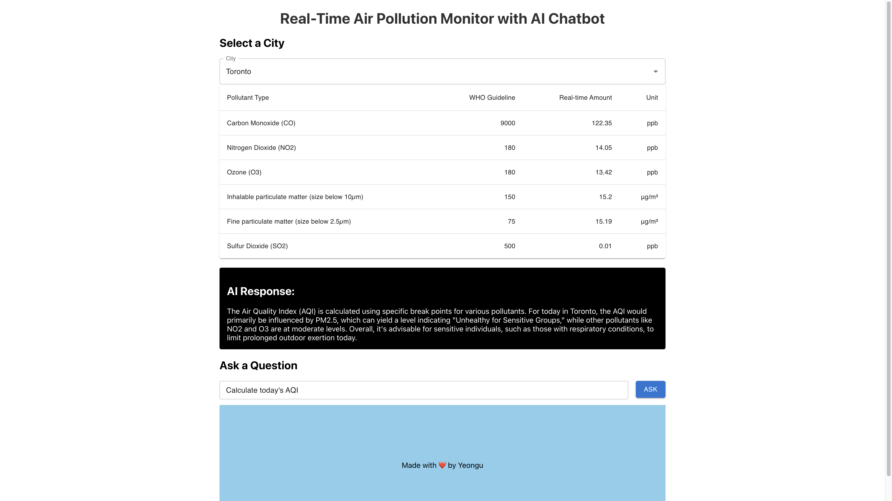

# Real-Time Air Pollutant Monitor with AI chatbot



## TerraHacks
- I've created this project for TerraHacks of TMU on August 2024.
- The application shows real-time air quality data acquired from Google API.
- Chatting functionality is implemented with Open AI API.

## How to run the project
- In Backend folder, run the spring application.
- In Frontend folder, run following commands
  ```bash
  npm install
  npm run start
  ```
